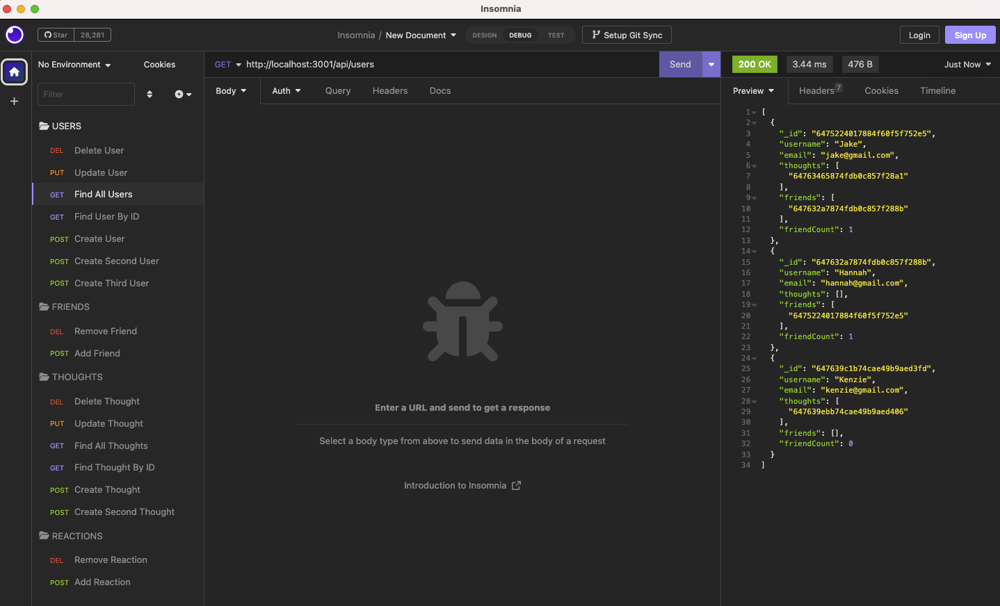

# NoSQL: Social Network API

## Application Links

* GitHub Repository for Application: 

## Description
For this week's Challenge, I was tasked to build a social network API from scratch using a NoSQL database. The **Social Network API** is intended to be used as a web application where users can share thoughts, reactions, and create a friend list. To create the back end functionality of the application, I used `Express.js` routing configuration, `MongoDB` database, and `Mongoose` ODM.

## Table of Contents

- [User Story](#user-story)
- [Acceptance Criteria](#acceptance-criteria)
- [Installation](#installation)
- [Usage](#usage)
- [Technologies Used](#technologies-used)
- [Questions](#questions)
- [License](#license)
- [Badges](#badges)

## User Story

```md
AS A social media startup
I WANT an API for my social network that uses a NoSQL database
SO THAT my website can handle large amounts of unstructured data
```

## Acceptance Criteria

```md
GIVEN a social network API
WHEN I enter the command to invoke the application
THEN my server is started and the Mongoose models are synced to the MongoDB database
WHEN I open API GET routes in Insomnia for users and thoughts
THEN the data for each of these routes is displayed in a formatted JSON
WHEN I test API POST, PUT, and DELETE routes in Insomnia
THEN I am able to successfully create, update, and delete users and thoughts in my database
WHEN I test API POST and DELETE routes in Insomnia
THEN I am able to successfully create and delete reactions to thoughts and add and remove friends to a user’s friend list
```

## Installation
1. To set up your environment, please begin by making sure you have the following already installed:

    * An open source code editor, such as [VS Code](https://code.visualstudio.com/)
    * [Git Bash](https://www.educative.io/answers/how-to-install-git-bash-in-windows) or [Zsh](https://github.com/ohmyzsh/ohmyzsh/wiki/Installing-ZSH) (to use in [Git](https://github.com/git-guides/install-git) command line)
    * [Node.js](https://nodejs.org/en)
    * [MongoDB](https://www.mongodb.com/)
    * [Insomnia](https://docs.insomnia.rest/insomnia/install)

2. Next, you will need to clone this [repository](https://github.com/mackenzie-wentworth/orm-e-commerce). From GitHub, copy the `SSH URL` and use the `git clone` command to paste the SSH URL to your terminal clipboard. 

    ```bash
        git clone [github ssh url]
    ```

3. Open the cloned repository in VS Code. Within VS Code, open a new integrated terminal and type the following `npm` command to install the [Node Package Manager](https://www.npmjs.com/):

    ```bash
        npm init -y
    ```

4. Next, type in the following `npm` command to install [Node Modules](https://docs.npmjs.com/cli/v8/commands/npm-install):

    ```bash
        npm i
    ```

## Usage
To demonstrate the functionality of the Social Network API, this project features application testing using [Insomnia](https://docs.insomnia.rest/insomnia/install).

### *How to Use Social Network API:*
1. In order to test the application in Insomnia, you will first need to invoke the application through your integrated terminal. Please type the following `npm` command:

    ```bash
        npm start
    ```

2. You should see a response in your terminal that reads, "Social Network API server now running on port 3001! 🚀"

3. You are now ready to start testing the apllication using **Insomnia**!



### *Walkthrough Video Demonstration:*
Users & Thoughts - [Click to watch video here!](https://github.com/mackenzie-wentworth/social-network-api/assets/122484637/7b9f291b-82d5-4baa-a2d1-3b5e961cecf7)

* GET routes for all users and all thoughts
* GET routes for a single user and a single thought
* POST, PUT, and DELETE routes for users and thoughts

Friends & Reactions - [Click to watch video here!](https://github.com/mackenzie-wentworth/social-network-api/assets/122484637/c3930820-1808-42c8-959d-1c11285d37d9)

* POST and DELETE routes for a user’s friend list
* POST and DELETE routes for reactions to thoughts

## Technologies Used

* [VS Code](https://code.visualstudio.com/)
* [Node.js](https://nodejs.org/en)
* [Node Package Manager](https://www.npmjs.com/)
* [MongoDB](https://www.mongodb.com/)
* [Mongoose](https://www.npmjs.com/package/mongoose)
* [Express](https://expressjs.com/)
* [Moment.js](https://www.npmjs.com/package/moment)
* [Insomnia](https://docs.insomnia.rest/insomnia/install)

---

## Questions?

If you have any questions, please see my contact information below to reach me for inquiries:
* **GitHub**: mackenzie-wentworth, at https://github.com/mackenzie-wentworth
* **Email**: mwentworth28@gmail.com

## License

This project is covered under the [MIT License](./LICENSE). For more details, please click the license icon below under 'Badges'.

## Badges
[](https://opensource.org/licenses/MIT)


